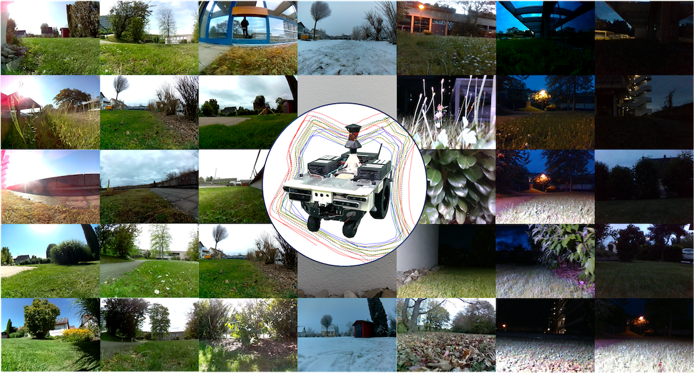

<h1 align="center">
  The ROVER Visual SLAM Benchmark
</h1>


<h1 align="center">
    
  
  
  
[](https://iis-esslingen.github.io/rover/)  [](https://arxiv.org/abs/2412.02506)

</h1>

<br>


## News <a name="news"></a>
- **`[2024/12/05]`** Initial code release.
- **`[2025/05/20]`** ROVER is accepted to IEEE Transactions on Robotics.
- **`[2025/05/25]`** Dataset released on HuggingFace.

## Getting Started
The only required software is [Docker](https://www.docker.com/). Each SLAM method comes with its own Docker container, making setup straightforward. We recommend using VSCode with the Docker extension for an enhanced development experience. Additionally, we provide a Docker container with tools for evaluating and handling the ROVER dataset.

When running the Dockerfiles, the first step is to navigate to the directory where the dataset is stored, as it will be mounted inside the Docker container.

Tested on Ubuntu 20.04 and 22.04 with CUDA versions 11 and 12, using NVIDIA GPUs including the RTX 4090, A5000, and A6000.

## Dataset
The dataset can be found here: [https://huggingface.co/datasets/iis-esslingen/ROVER](https://huggingface.co/datasets/iis-esslingen/ROVER).

## SLAM Methods
Each method is available as a Docker container. When running the Dockerfiles, the first step is to enter the directory where the dataset is stored, as it will be mounted inside the Docker container.

<details><summary>DPVO & DPV-SLAM</summary>

We are using [our fork](https://github.com/iis-esslingen/DPV-SLAM) of the official [DPVO / DPV-SLAM](https://github.com/princeton-vl/DPVO) implementation. 
  
**Note:** The container currently does not support visualization.

Example to run the application and evaluation:

```bash
python evaluate_rover.py \
    --base_data_path /garden_small/2023-08-18 \
    --ground_truth_path /garden_small/2023-08-18/ground_truth.txt \
    --output_path ./rover_trajectories \
    --cameras d435i t265 pi_cam \
    --trials 5
```

#### Parameters:

-  `base_data_path`: Specifies the base directory of the dataset sequence.
-  `ground_truth_path`: Path to the ground truth file for the selected dataset sequence.
-  `output_path`: Directory where the resulting trajectories will be stored.
-  `cameras`: List of cameras to be used for the evaluation. Choices: `d435i`, `t265`, or `pi_cam`.
-  `trials`: The number of trials to execute for the evaluation.

To enable Loop Closing for DPV-SLAM, add the argument: `--opts LOOP_CLOSURE True`.

</details> 

<details><summary>DROID-SLAM</summary>

We are using [our fork](https://github.com/iis-esslingen/DROID-SLAM) of the official [DROID-SLAM](https://github.com/princeton-vl/DROID-SLAM) implementation. 

Separate scripts are provided for each camera in the `DROID-SLAM/evaluation_scripts` folder, namely `test_rover_d435i.py`, `test_rover_pi-cam-02.py`, and `test_rover_t265.py`.

Example to run the application and evaluation:

```bash
python evaluation_scripts/test_rover_d435i.py \
    --data_path /garden_small/2023-08-18 \
    --ground_truth_path /garden_small/2023-08-18/ground_truth.txt \
    --output_path ./rover_trajectories
```

#### Parameters:

-  `base_data_path`: Specifies the base directory of the dataset sequence.
-  `ground_truth_path`: Path to the ground truth file for the selected dataset sequence.
-  `output_path`: Directory where the resulting trajectories will be stored.

To test DROID-SLAM in RGBD mode (Camera D435i), add the flag `--depth`, for Stereo mode (Camera T265) add `--stereo`.

</details>


<details><summary>OpenVINS</summary>

We are using [our fork](https://github.com/iis-esslingen/OpenVINS) of the official [OpenVINS](https://github.com/rpng/open_vins) implementation. 

To launch the application:

```bash
roslaunch ov_msckf <launch_file> \
    do_bag:=<do_bag> bag:=<bag> \
    do_save_traj:=<do_save_traj> \
    traj_file_name:=<traj_file_name>
```

#### Parameters:

- `launch_file`: Specifies the launch file to use. Choices include:
    - `rover_mono-inertial_d435i_external.launch`
    - `rover_mono-inertial_d435i_internal.launch`
    - `rover_mono-inertial_pi-cam-02_external.launch`
    - `rover_mono-inertial_t265_external.launch`
    - `rover_mono-inertial_t265_internal.launch`
    - `rover_stereo-inertial_t265_external.launch`
    - `rover_stereo-inertial_t265_internal.launch`

- `do_bag`: *(Optional)* Specifies whether to replay a bag. Set to either:
    - `true`: To replay a bag.
    - `false`: To not replay a bag.

- `bag`: *(Optional)* Specifies the path to the rosbag file.

- `do_save_traj`: *(Optional)* Specifies whether to save a predicted trajectory. Set to either:
    - `true`: To save the trajectory.
    - `false`: To not save the trajectory.

- `traj_file_name`: *(Optional)* Specifies the file path where the estimated trajectory should be saved.

</details>


<details><summary>VINS-Fusion</summary>

We are using [our fork](https://github.com/iis-esslingen/VINS-Fusion) of the official [VINS-Fusion](https://github.com/HKUST-Aerial-Robotics/VINS-Fusion) implementation. 

To launch the application:

```bash
roslaunch vins <launch_file> \
    do_bag:=<do_bag> bag:=<bag> \
    do_save_traj:=<do_save_traj> \
    traj_file_name:=<traj_file_name> \
    do_lc:=<enable_loop_closing>
```

#### Parameters:

- `launch_file`: Specifies the launch file to use. Choices include:
    - `rover_mono-inertial_d435i_external.launch`
    - `rover_mono-inertial_d435i_internal.launch`
    - `rover_mono-inertial_pi-cam-02_external.launch`
    - `rover_mono-inertial_t265_external.launch`
    - `rover_mono-inertial_t265_internal.launch`
    - `rover_stereo_t265.launch`
    - `rover_stereo-inertial_t265_external.launch`
    - `rover_stereo-inertial_t265_internal.launch`

- `do_bag`: *(Optional)* Specifies whether to replay a bag. Set to either:
    - `true`: To replay a bag.
    - `false`: To not replay a bag.

- `bag`: *(Optional)* Specifies the path to the rosbag file.

- `do_save_traj`: *(Optional)* Specifies whether to save a predicted trajectory. Set to either:
    - `true`: To save the trajectory.
    - `false`: To not save the trajectory.

- `traj_file_name`: *(Optional)* Specifies the file path where the estimated trajectory should be saved.

- `do_lc`: *(Optional)* Specifies whether to enable loop closing. Set to either:
    - `true`: To enable loop closing.
    - `false`: To disable loop closing.

</details>


<details><summary>SVO-Pro</summary>

We are using [our fork](https://github.com/iis-esslingen/SVO-Pro) of the official [SVO-Pro](https://github.com/uzh-rpg/rpg_svo_pro_open) implementation. 

To launch the application:

```bash
roslaunch svo_ros <launch_file> \
    do_bag:=<do_bag> bag:=<bag> \
    do_save_traj:=<do_save_traj> \
    traj_file_name:=<traj_file_name> \
    do_lc:=<enable_loop_closing>
```

#### Parameters:

- `launch_file`: Specifies the launch file to use. Choices include:
    - `rover_mono_d435i.launch`
    - `rover_mono_pi-cam-02.launch`
    - `rover_mono_t265.launch`
    - `rover_mono-inertial_d435i_external.launch`
    - `rover_mono-inertial_d435i_internal.launch`
    - `rover_mono-inertial_pi-cam-02_external.launch`
    - `rover_mono-inertial_t265_external.launch`
    - `rover_mono-inertial_t265_internal.launch`
    - `rover_stereo_t265.launch`
    - `rover_stereo-inertial_t265_external.launch`
    - `rover_stereo-inertial_t265_internal.launch`

- `do_bag`: *(Optional)* Specifies whether to replay a bag. Set to either:
    - `true`: To replay a bag.
    - `false`: To not replay a bag.

- `bag`: *(Optional)* Specifies the path to the rosbag file.

- `do_save_traj`: *(Optional)* Specifies whether to save a predicted trajectory. Set to either:
    - `true`: To save the trajectory.
    - `false`: To not save the trajectory.

- `traj_file_name`: *(Optional)* Specifies the file path where the estimated trajectory should be saved.

- `do_lc`: *(Optional)* Specifies whether to enable loop closing. Set to either:
    - `true`: To enable loop closing.
    - `false`: To disable loop closing.

</details>


<details><summary>ORB-SLAM3</summary>

We are using [our fork](https://github.com/iis-esslingen/ORB-SLAM3) of the [ORB-SLAM3 ROS Wrapper](https://github.com/thien94/orb_slam3_ros) implementation. 

To launch the application:

```bash
roslaunch orb_slam3_ros <launch_file> \
    do_bag:=<do_bag> bag:=<bag> \
    do_save_traj:=<do_save_traj> \
    traj_file_name:=<traj_file_name> \
    do_lc:=<enable_loop_closing>
```

#### Parameters:

- `launch_file`: Specifies the launch file to use. Choices include:
    - `rover_mono_d435i.launch`
    - `rover_mono_pi-cam-02.launch`
    - `rover_mono_t265.launch`
    - `rover_mono-inertial_d435i_external.launch`
    - `rover_mono-inertial_d435i_internal.launch`
    - `rover_mono-inertial_pi-cam-02_external.launch`
    - `rover_mono-inertial_t265_external.launch`
    - `rover_mono-inertial_t265_internal.launch`
    - `rover_stereo_t265.launch`
    - `rover_stereo-inertial_t265_external.launch`
    - `rover_stereo-inertial_t265_internal.launch`
    - `rover_rgbd_d435i.launch`
    - `rover_rgbd-inertial_d435i_external.launch`
    - `rover_rgbd-inertial_d435i_internal.launch`

- `do_bag`: *(Optional)* Specifies whether to replay a bag. Set to either:
    - `true`: To replay a bag.
    - `false`: To not replay a bag.

- `bag`: *(Optional)* Specifies the path to the rosbag file.

- `do_save_traj`: *(Optional)* Specifies whether to save a predicted trajectory. Set to either:
    - `true`: To save the trajectory.
    - `false`: To not save the trajectory.

- `traj_file_name`: *(Optional)* Specifies the file path where the estimated trajectory should be saved.

- `do_lc`: *(Optional)* Specifies whether to enable loop closing. Set to either:
    - `true`: To enable loop closing.
    - `false`: To disable loop closing.
 
</details>

## Utilities


<details><summary>Convert Raw Dataset to Rosbag</summary>

`raw_to_rosbag.py` is a Python script designed to convert raw sensor data into a ROS bag file. This tool is useful for working with robotics datasets, enabling streamlined integration with ROS-based tools and workflows.

The script supports various sensors and offers customization options through command-line arguments.

### Command Syntax

```bash
python raw_to_rosbag.py \
    --input_directory <input_directory> \
    --output_bag <output_bag> \
    --sensors <sensor_list> \
    [--imu_sync_strategy <imu_sync_strategy>]
```

#### Parameters:

- `input_directory`: Path to the directory containing raw sensor data.
- `output_bag`: Path to the output ROS bag file. Defaults to `<input_directory>/rosbag.bag`.
- `sensors`: List of sensors to include in the ROS bag. Choices are: `d435i`, `t265`, `pi_cam`, and `vn100`.
- `imu_sync_strategy`: IMU synchronization strategy. Choices are: `merge` (default), `downsampling`, or `upsampling`.

The `--imu_sync_strategy` parameter defines how to synchronize IMU data from multiple sensors. The available options are:

- **merge (default)**: This strategy combines IMU data from multiple sources by fusing the accelerometer and gyrometer readings. It ensures that the data is aligned and integrated into a single stream.
  
- **downsampling**: This strategy reduces the frequency of IMU data to match the lowest rate among the available sensors. It can be useful when the sensors operate at different frequencies, and you want to ensure synchronization at a lower rate.

- **upsampling**: This strategy increases the frequency of IMU data to match the highest rate among the available sensors. It interpolates data to achieve a higher frequency, ensuring synchronization at the rate of the fastest sensor.

</details>

<details><summary>Evaluation</summary>

  tbd.
</details>

## Citing
If you find our work useful, please consider citing:
```bibtex
@article{schmidt2025rover,
      title={ROVER: A Multi-Season Dataset for Visual SLAM}, 
      author={Fabian Schmidt and Julian Daubermann and Marcel Mitschke and Constantin Blessing and Stefan Meyer and Markus Enzweiler and Abhinav Valada},
      year={2025},
      eprint={2412.02506},
      archivePrefix={arXiv},
      primaryClass={cs.RO},
      url={https://arxiv.org/abs/2412.02506}, 
}
```
